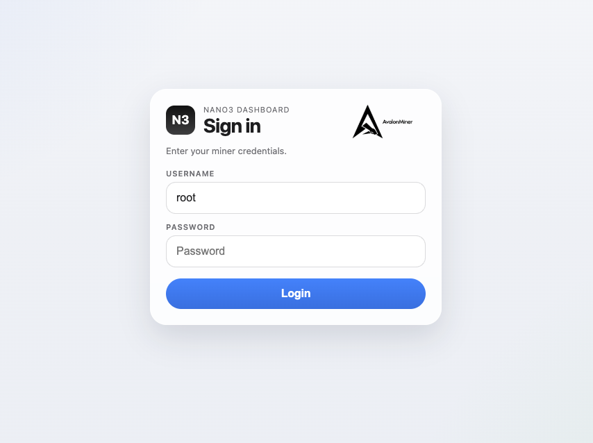
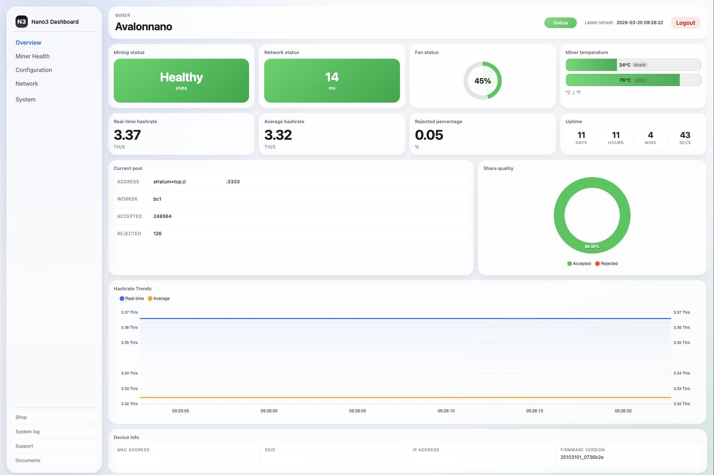
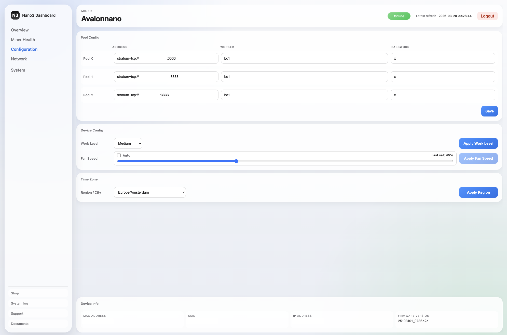
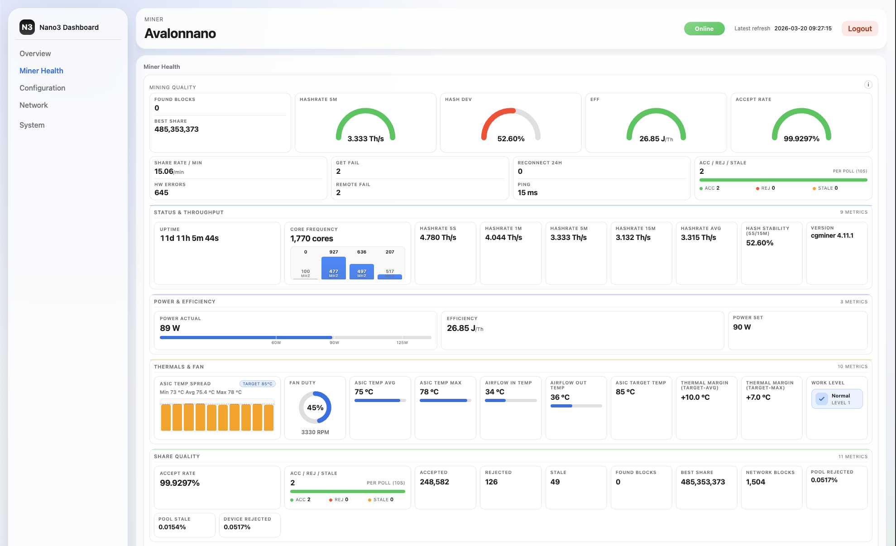
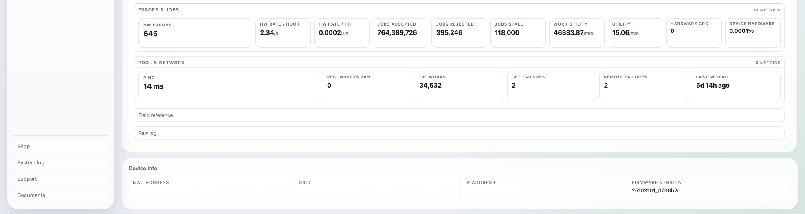

# Nano3 Dashboard

Web UI refresh for the Canaan Avalon Nano 3, plus a lightweight cgminer API proxy for safe fan control from the browser.

> [!IMPORTANT]
> This project targets Nano 3 firmware/web stack compatible with the existing CGI endpoints used in `/mnt/heater/www/html/*.html` and cgminer API on `127.0.0.1:4028`.

---

## Table of Contents

- [Features](#features)
- [Screenshots](#screenshots)
- [Repository Layout](#repository-layout)
- [Prerequisites](#prerequisites)
- [Installation](#installation)
- [Usage](#usage)
- [cgminer API Proxy](#cgminer-api-proxy)
- [Rollback](#rollback)
- [Troubleshooting](#troubleshooting)
- [Reference](#reference)

---

## Features

- Refreshed UI across Nano 3 pages (`overview`, `configuration`, `network`, `miner health`, `system` pages)
- Improved miner health parsing and visual metrics (gauges, bars, quality blocks, thermals)
- Safe HTTP-to-cgminer proxy on port `4029` with allowlist filtering
- Fan speed control support via cgminer `ascset` (`fan-spd`) through browser
- One-shot install script that:
  - installs proxy handler and init script
  - starts/restarts proxy
  - backs up current web root
  - deploys updated HTML files

---

## Screenshots

### Login


### Overview


### Configuration


### Miner Health



---

## Repository Layout

```text
.
├── src/                                 # Web UI pages to deploy
│   ├── overview.html
│   ├── cgminercfg.html
│   ├── networkcfg.html
│   ├── cgminer_log.html
│   ├── administrator.html
│   ├── upgrade.html
│   ├── system_log.html
│   ├── reboot.html
│   ├── resetfac.html
│   ├── wifi.html
│   ├── login.html
│   └── index.html
├── tools/app/cgminer_api_proxy_handler.sh
├── tools/init_d/S92cgminer_api_proxy.sh
└── install_n3_web.sh
```

---

## Prerequisites

- Nano 3 with shell access (`admin` + `sudo`)
- BusyBox environment with:
  - `inetd`
  - `telnet`
  - `start-stop-daemon`
- Writable paths on device:
  - `/mnt/heater/app/`
  - `/etc/init.d/`
  - `/mnt/heater/www/html/`

---

## Installation

From your local machine (inside this repo):

```bash
# copy project to miner (example)
scp -r ./ admin@<MINER_IP>:~/nano3_web

# run installer on miner
ssh admin@<MINER_IP>
cd ~/nano3_web
sudo sh ./install_n3_web.sh
```

The installer will:

1. Copy proxy handler to `/mnt/heater/app/cgminer_api_proxy_handler.sh` (`755`)
2. Copy init script to `/etc/init.d/S92cgminer_api_proxy.sh` (`644`)
3. Start/restart the proxy service
4. Backup `/mnt/heater/www/html` to `/mnt/heater/www/html_backup.tar`
5. Copy all `src/*.html` into `/mnt/heater/www/html/`

---

## Usage

Open the miner web UI normally:

- `http://<MINER_IP>/`

Updated pages are served from `/mnt/heater/www/html/` after installation.

---

## cgminer API Proxy

Purpose:

- Expose a minimal HTTP endpoint on `:4029`
- Forward allowlisted JSON commands to cgminer API on `127.0.0.1:4028`

Current allowlist:

- `{"command":"ascset","parameter":"0,fan-spd,<value>"}`
- `<value>` allowed: `-1` (auto) or `0..100`

Manual tests:

```bash
# CORS preflight
curl -i -X OPTIONS "http://<MINER_IP>:4029/" \
  -H "Origin: http://<MINER_IP>" \
  -H "Access-Control-Request-Method: POST"

# Valid command
curl -i "http://<MINER_IP>:4029/" \
  -H "Content-Type: application/json" \
  --data '{"command":"ascset","parameter":"0,fan-spd,100"}'

# Blocked command (expected 403)
curl -i "http://<MINER_IP>:4029/" \
  -H "Content-Type: application/json" \
  --data '{"command":"devs","parameter":""}'
```

---

## Rollback

Restore previous web files:

```bash
cd /
sudo tar -xf /mnt/heater/www/html_backup.tar
```

Stop proxy if needed:

```bash
sudo sh /etc/init.d/S92cgminer_api_proxy.sh stop
```

---

## Troubleshooting

- Proxy not running:
  - `ps | grep [i]netd`
  - `cat /tmp/cgminer_api_proxy.log`
- Handler not executable:
  - `chmod 755 /mnt/heater/app/cgminer_api_proxy_handler.sh`
- Fan POST fails from browser:
  - verify `OPTIONS` and `POST` with curl against `:4029`
  - ensure handler allowlist matches payload exactly
- UI deployment issues:
  - confirm files exist in `/mnt/heater/www/html/`
  - hard refresh browser cache
